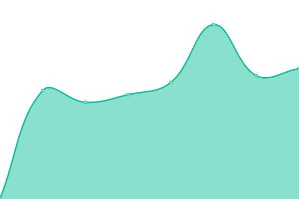

# [📈 CommandCode Status](https://status.commandcode.ai)

This repository contains the open-source uptime monitor and status page for [Command Code](https://CommandCode.ai), powered by [Upptime](https://github.com/upptime/upptime).

With [Upptime](https://upptime.js.org), you can get your own unlimited and free uptime monitor and status page, powered entirely by a GitHub repository. We use [Issues](https://github.com/CommandCodeAI/commandcode-status/issues) as incident reports, [Actions](https://github.com/CommandCodeAI/commandcode-status/actions) as uptime monitors, and [Pages](https://status.commandcode.ai) for the status page.

We use [Issues](https://github.com/CommandCodeAI/status/issues) as incident reports, [Actions](https://github.com/CommandCodeAI/status/actions) as uptime monitors, and [Pages](https://status.commandcode.ai/) for the status page.

<!--start: status pages-->
<!-- This summary is generated by Upptime (https://github.com/upptime/upptime) -->
<!-- Do not edit this manually, your changes will be overwritten -->
<!-- prettier-ignore -->
| URL | Status | History | Response Time | Uptime |
| --- | ------ | ------- | ------------- | ------ |
|  [Command Code](https://api.commandcode.ai) | 🟩 Up | [command-code.yml](https://github.com/CommandCodeAI/commandcode-status/commits/HEAD/history/command-code.yml) | 

 744ms
     
 | 

<a href="https://status.commandcode.ai/history/command-code">100.00%</a>
    

<!--end: status pages-->

[**Visit our status website →**](https://status.commandcode.ai)
